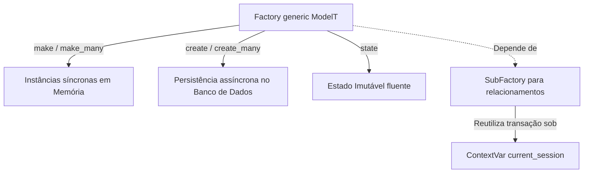
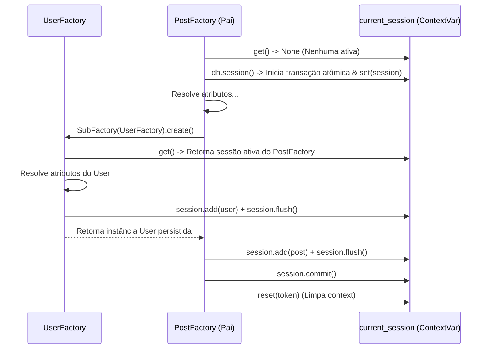

# Model Factories & Faker — Geração de Dados de Teste de Alta Performance

Aura fornece uma infraestrutura robusta, elegante e de altíssimo nível para **Model Factories** (Fábricas de Modelos) integrada de forma nativa com a biblioteca **Faker**. O objetivo é elevar a Developer Experience (DX) ao máximo, permitindo que desenvolvedores definam esquemas de geração de dados realistas para testes de unidade, testes de integração e seeders de banco de dados de forma expressiva e limpa.

---

## 1. Princípios e Arquitetura

Escrever testes de software requer a criação consistente de estados complexos de dados. Instanciar modelos de banco de dados manualmente gera código repetitivo (*boilerplate*), frágil e de difícil manutenção. 

A infraestrutura de Factories do Aura resolve esse problema baseando-se em três pilares arquiteturais:



1. **Separação Estrita de Estratégias:** Diferenciação clara entre geração síncrona em memória (extremamente rápida) e persistência assíncrona no banco de dados.
2. **Imutabilidade de Estado:** Métodos fluentes de definição de estado que retornam novas instâncias da fábrica, eliminando efeitos colaterais em escopos globais de teste.
3. **Resolução de Relacionamentos Atômicos:** Mapeamento de chaves estrangeiras (`ForeignKey`) de maneira recursiva usando a mesma sessão transacional via variáveis de contexto (`ContextVar`), evitando colisões de conexão e erros de integridade.

---

## 2. Definindo uma Fábrica

Para criar uma fábrica, herde da classe base `Factory[ModelT]`, especifique o modelo alvo definindo o atributo `model` (ou permitindo que o Aura o infira através do parâmetro genérico `ModelT`) e implemente o método `definition()`.

O Aura pré-configura uma instância de `Faker` acessível diretamente através de `self.faker` em cada fábrica para gerar dados realistas:

```python
from aura.orm import Factory, CharField, EmailField, BooleanField, AuraModel
from sqlalchemy.orm import Mapped

# 1. Definindo o Modelo Aura
class User(AuraModel):
    __tablename__ = "users"

    name: Mapped[str] = CharField(max_length=100)
    email: Mapped[str] = EmailField(unique=True)
    is_active: Mapped[bool] = BooleanField(default=True)
    is_admin: Mapped[bool] = BooleanField(default=False)

# 2. Definindo a Fábrica
class UserFactory(Factory[User]):
    # Opcional se usar o generic Factory[User], mas útil para legibilidade:
    model = User

    def definition(self) -> dict:
        return {
            "name": lambda: self.faker.name(),
            "email": lambda: self.faker.unique.email(),
            "is_active": True,
            "is_admin": False,
        }
```

> [!TIP]
> **Por que usar lambdas ou callables na definição?**  
> Ao definir atributos dinâmicos como `self.faker.name`, utilize um callable (como uma expressão lambda ou a referência direta da função `self.faker.name`). O Aura resolve callables em tempo de execução para cada modelo gerado, garantindo que cada instância tenha dados únicos e aleatórios. Se você definir `"name": self.faker.name()` diretamente, o valor será gerado uma única vez na inicialização da classe, resultando em valores idênticos em todas as instâncias fabricadas.

---

## 3. Separação de Estratégias: Geração Síncrona vs. Persistência Assíncrona

A velocidade de execução da suíte de testes é crucial. Para testes de unidade puros (como testar validação de regras de negócios ou serialização de DTOs), tocar no banco de dados é um desperdício de tempo e recursos. Para testes de integração de ponta a ponta (como controladores HTTP ou repositórios customizados), a persistência real é necessária.

O Aura oferece métodos específicos para cada estratégia de forma explícita.

### A. Geração Síncrona em Memória (Sem I/O)

Estes métodos criam instâncias do modelo de banco de dados apenas em memória RAM. Eles são síncronos, extremamente rápidos e não requerem conexões com o banco de dados.

*   `make(**overrides) -> ModelT`: Cria uma única instância em memória.
*   `make_many(count: int, **overrides) -> list[ModelT]`: Cria uma lista contendo `count` instâncias em memória.

```python
# Geração síncrona simples
user = UserFactory().make()
print(user.name)  # Ex: "Jonathan David"
print(user.id)    # None (não persistido)

# Geração com sobreposição (overrides)
inactive_user = UserFactory().make(is_active=False)
print(inactive_user.is_active)  # False

# Geração de lotes
users = UserFactory().make_many(5)
assert len(users) == 5
```

### B. Persistência Assíncrona no Banco (Com I/O)

Estes métodos são assíncronos (`async/await`), resolvem as dependências, salvam os modelos no banco de dados, efetuam o *flush/commit* e realizam o *refresh* das chaves primárias e atributos autogerados.

*   `await create(**overrides) -> ModelT`: Cria e persiste uma única instância.
*   `await create_many(count: int, **overrides) -> list[ModelT]`: Cria e persiste uma lista contendo `count` instâncias dentro da mesma transação.

```python
# Persistência assíncrona simples
user = await UserFactory().create()
print(user.id)  # Ex: 1 (ID gerado pelo banco de dados)

# Persistência de lote de forma atômica e eficiente
users = await UserFactory().create_many(10, is_active=True)
assert len(users) == 10
assert all(u.id is not None for u in users)
```

---

## 4. Estado Imutável com `.state(**attrs)`

Compartilhar instâncias globais de fábricas em arquivos de teste pode introduzir efeitos colaterais indesejados onde o teste A modifica as configurações da fábrica e acaba quebrando o teste B de forma silenciosa.

Para evitar isso, o Aura adota o padrão de **Estado Imutável**. Ao chamar o método `.state(**attrs)`, a fábrica original **não** é modificada. Em vez disso, uma nova instância derivada da fábrica contendo as propriedades adicionadas é retornada. Isso permite o encadeamento fluente de estados especialistas:

```python
# Fábrica base
user_factory = UserFactory()

# Criando fábricas especializadas e isoladas
admin_factory = user_factory.state(is_admin=True)
inactive_admin_factory = admin_factory.state(is_active=False)

# Uso das fábricas sem que uma afete a outra
regular_user = user_factory.make()          # is_admin=False, is_active=True
admin_user = admin_factory.make()          # is_admin=True,  is_active=True
inactive_admin = inactive_admin_factory.make() # is_admin=True,  is_active=False
```

Com essa abordagem, você pode expor fábricas pré-configuradas em seus arquivos de testes ou fixtures de forma limpa:

```python
# conftest.py ou factories.py do seu módulo
class PostFactory(Factory[Post]):
    model = Post
    # ... definition ...

    @property
    def published(self) -> PostFactory:
        return self.state(is_published=True)

    @property
    def draft(self) -> PostFactory:
        return self.state(is_published=False)
```

---

## 5. Resolução de Relacionamentos com `SubFactory`

Em bancos de dados relacionais, entidades frequentemente possuem chaves estrangeiras vinculadas a outras tabelas. A classe `SubFactory` permite declarar esses relacionamentos de forma declarativa e automática.

### O Problema do Escopo de Sessão em ORMs Assíncronos

Em frameworks tradicionais assíncronos, relacionamentos gerados por fábricas frequentemente causam dores de cabeça como:
*   `DetachedInstanceError`: Ocorre quando o relacionamento tenta ser persistido ou acessado sob uma sessão de banco de dados diferente daquela que iniciou o objeto pai.
*   Múltiplas conexões abertas simultaneamente para gerar chaves primárias filhas, resultando em lentidão extrema nos testes ou estourando o pool de conexões do driver assíncrono.

### A Solução Atômica do Aura

O Aura resolve isso de forma elegante através do gerenciamento contextualizado baseado em `ContextVar` e a classe utilitária `current_session` do ORM:



1.  **Reuso de Sessão Ativa:** Quando `.create()` é invocado em uma fábrica pai, o Aura busca a transação ativa através de `current_session.get()`.
2.  **Encadeamento Transacional:** Se uma sessão já existir no contexto (por exemplo, um middleware de requisição HTTP, um seeder global ou uma transação de teste), as fábricas filhas (`SubFactory`) a reutilizam de forma transparente, executando apenas `await session.flush()` para obter seus IDs primários sem efetuar commits prematuros.
3.  **Transação Unitária Isolada:** Caso nenhuma sessão esteja ativa, a fábrica pai abre uma transação com `async with db.session() as session:`, registra essa sessão na ContextVar `current_session`, resolve de forma recursiva e atômica todas as `SubFactory` na mesma transação, faz o commit final de uma só vez e limpa o contexto de forma segura em um bloco `finally`.

---

## 6. Exemplo Prático Completo

Abaixo está um cenário completo com dois modelos relacionados: `User` e `Post`.

### 1. Definição dos Modelos (`models.py`)

```python
from aura.orm import AuraModel, CharField, EmailField, BooleanField, TextField, ForeignKey
from sqlalchemy import Integer
from sqlalchemy.orm import Mapped, relationship

class User(AuraModel):
    __tablename__ = "users"

    name: Mapped[str] = CharField(max_length=120)
    email: Mapped[str] = EmailField(unique=True)
    is_active: Mapped[bool] = BooleanField(default=True)

    posts: Mapped[list["Post"]] = relationship("Post", back_populates="author")

class Post(AuraModel):
    __tablename__ = "posts"

    title: Mapped[str] = CharField(max_length=200)
    content: Mapped[str] = TextField()
    is_published: Mapped[bool] = BooleanField(default=False)
    
    author_id: Mapped[int] = ForeignKey("users.id", ondelete="CASCADE")
    author: Mapped["User"] = relationship("User", back_populates="posts")
```

### 2. Definição das Fábricas (`factories.py`)

```python
from aura.orm import Factory, SubFactory
from .models import User, Post

class UserFactory(Factory[User]):
    model = User

    def definition(self) -> dict:
        return {
            "name": lambda: self.faker.name(),
            "email": lambda: self.faker.unique.email(),
            "is_active": True,
        }

class PostFactory(Factory[Post]):
    model = Post

    def definition(self) -> dict:
        return {
            "title": lambda: self.faker.sentence(nb_words=6),
            "content": lambda: self.faker.paragraph(nb_sentences=3),
            "is_published": False,
            "author": SubFactory(UserFactory), # Associa um novo usuário automaticamente
        }
```

### 3. Utilizando as Fábricas em Testes (`test_posts.py`)

O exemplo abaixo demonstra a elegância da Developer Experience ao escrever testes de integração no Aura:

```python
import pytest
from aura.orm import db
from .factories import UserFactory, PostFactory

# Habilita suporte a testes assíncronos no pytest
pytestmark = pytest.mark.asyncio

async def test_should_create_post_with_associated_author():
    # 1. Arrange & Act (Persiste post + autor automaticamente e atómicamente)
    post = await PostFactory().create(title="Aura: O Futuro do Python")

    # 2. Assert
    assert post.id is not None
    assert post.title == "Aura: O Futuro do Python"
    
    # O autor foi criado e associado pela SubFactory de forma perfeita!
    assert post.author_id is not None
    assert post.author.id == post.author_id
    assert "@" in post.author.email

async def test_should_create_batch_of_posts_for_specific_user():
    # 1. Arrange
    # Criamos o autor uma única vez
    author = await UserFactory().create(name="Maria Silva")
    
    # 2. Act
    # Criamos 5 posts atribuindo explicitamente o mesmo autor para todos
    posts = await PostFactory().state(is_published=True).create_many(
        count=5, 
        author=author  # Substitui o SubFactory pelo autor existente!
    )

    # 3. Assert
    assert len(posts) == 5
    for post in posts:
        assert post.is_published is True
        assert post.author_id == author.id
        assert post.author.name == "Maria Silva"
```

---

## 7. Boas Práticas

1.  **Prefira `.make()` para Testes de Unidade:** Se a classe ou lógica sendo testada não salva dados no banco de dados de fato, use `.make()`. Os testes rodarão centenas de vezes mais rápido.
2.  **Use Lambdas para Campos Únicos:** Sempre que usar geradores do Faker que possuem restrição de unicidade (como `self.faker.unique.email()`), envolva-os em uma expressão lambda (`lambda: self.faker.unique.email()`). Isso garante que um valor fresco seja computado a cada ciclo de geração.
3.  **Encapsule Estados Comuns:** Se o seu modelo possui variações comuns de domínio (ex: usuários `ativos`, `bloqueados`, `administradores`, `premium`), encapsule-os em propriedades da fábrica retornando `.state()` para aumentar a legibilidade e o reuso em toda a suíte de testes.
