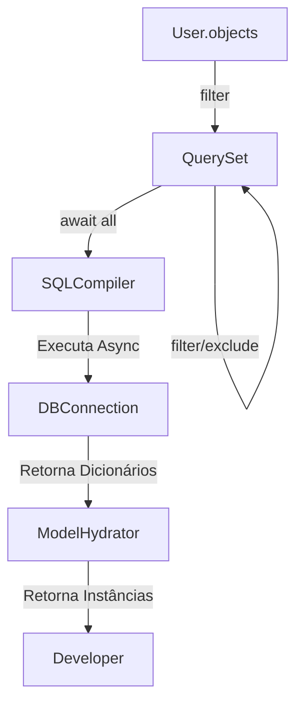

# Aura SQL ORM — Especificação de Design e Arquitetura

O Aura SQL ORM é uma ferramenta de mapeamento objeto-relacional (ORM) async-first, altamente integrada ao contêiner de Injeção de Dependência do Aura. Ele combina o padrão **Active Record** (consagrado pelo Django) com a segurança de tipos moderna do Python.

---

## 1. Princípios de Design

1. **Zero Boilerplate:** Sem necessidade de sessões manuais ou chamadas a `commit()` na camada de negócios.
2. **Estilo Django (Active Record & Manager):** Modelos salvam a si mesmos (`user.save()`) e consultas usam uma API fluida de encadeamento (`User.objects.filter(...)`).
3. **Segurança de Tipos Estrita (mypy/Pylance):** Total suporte a autocomplete sem necessidade de plugins de IDE.
4. **Async-First por Padrão:** Todas as chamadas de banco de dados são não-bloqueantes.

---

## 2. Exemplo de Uso Prático

### Definição do Modelo
```python
from aura.orm import AuraModel, CharField, EmailField, BooleanField
from sqlalchemy.orm import Mapped

class User(AuraModel):
    __tablename__ = "users"

    name: Mapped[str] = CharField(max_length=100)
    email: Mapped[str] = EmailField(unique=True)
    is_active: Mapped[bool] = BooleanField(default=True)
    # id, created_at, updated_at são herdados automaticamente de AuraModel
```

### Consultando Dados (O Manager `objects`)
```python
# Buscar todos os usuários ativos
active_users = await User.objects.filter(is_active=True).all()

# Buscar um usuário específico por e-mail (levanta exceção se não encontrado)
user = await User.objects.get(email="jonathan@aura.dev")

# Paginação fácil e fluida
page = await User.objects.filter(is_active=True).paginate(page=1, per_page=10)
```

### Salvando e Atualizando (Active Record)
```python
# Criar e salvar
new_user = User(name="Alice", email="alice@aura.dev")
await new_user.save() # Realiza o INSERT automaticamente

# Atualizar atributos
new_user.name = "Alice Silva"
await new_user.save() # Realiza o UPDATE automaticamente
```

---

## 3. Arquitetura Interna: Sob o Capô

O Aura ORM utiliza uma abordagem híbrida: ele expõe a API do Django, mas utiliza o **SQLAlchemy Core** como compilador de dialetos e gerenciador de pool de conexões.

### O QuerySet Async
Toda consulta inicia no manager `objects`, que retorna uma instância de `QuerySet`. O `QuerySet` acumula filtros de forma preguiçosa (lazy evaluation) e compila para SQL apenas quando um método terminal (como `all()`, `first()` ou `get()`) é aguardado (`await`).



### Context-Aware Session Management
Assim como no nosso sistema de DI, o Aura ORM utiliza `contextvars` para rastrear a transação ativa da requisição HTTP atual. Quando `user.save()` é chamado, ele detecta automaticamente a conexão ativa na thread/task atual, garantindo atomicidade e eliminando a necessidade de passar conexões manualmente.
